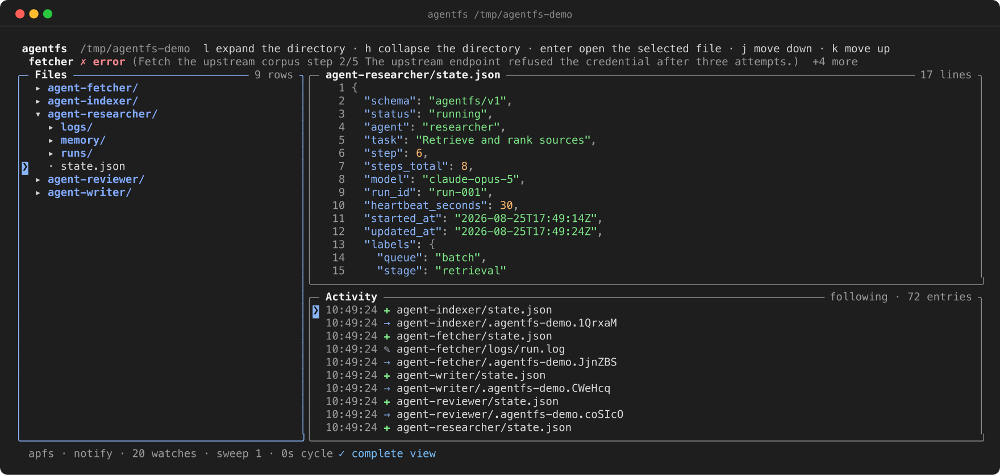
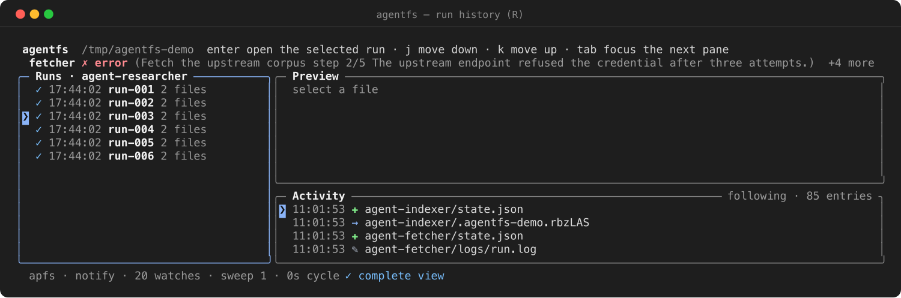
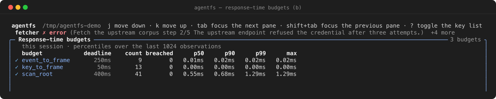

# agentfs

Watch AI agent workspaces on disk, in a terminal. Single binary, one argument.

<p align="center">
  
</p>

Point it at a directory where agents persist state, logs, memory and artifacts. agentfs draws what is
there and keeps it current as the files change.

It also publishes the contract those agents write against, so what a workspace declares can be
validated rather than guessed at.

Built with Go, [Bubble Tea](https://github.com/charmbracelet/bubbletea) and
[Lip Gloss](https://github.com/charmbracelet/lipgloss).

---

## Install

```sh
go install github.com/stxkxs/agentfs@latest
```

Or from source, which requires Go 1.26.7 or later:

```sh
git clone https://github.com/stxkxs/agentfs.git
cd agentfs
task build     # or: go build -o agentfs .
./agentfs ./workspace
```

---

## Use

```sh
agentfs <directory>            # watch, the default
agentfs watch <directory>
agentfs scan <directory>       # one-shot, text or --format json
agentfs validate <directory>   # conformance gate, exit 1 on findings
agentfs doctor <directory>     # how the workspace is observed, and what it costs
agentfs schema                 # the published contract
agentfs version
```

`agentfs --help` lists every flag. Each has an `AGENTFS_`-prefixed environment variable.

`scan` reads every agent once and prints what it declares, so a shell can ask what is running without
drawing anything:

```console
$ agentfs scan ./workspace
fetcher      declared   error      Fetch the upstream corpus · step 2 · claude-opus-5 · problem: The upstream endpoint refused the credential after three attempts.
indexer      declared   done       Index the workspace tree · step 8 · claude-opus-5 · problem: The first index pass timed out and was retried.
researcher   declared   running    Retrieve and rank sources · step 3 · claude-opus-5
reviewer     declared   blocked    Awaiting approval to publish the summary · step approval · claude-opus-5
writer       declared   running    Draft the summary · step drafting · claude-opus-5
```

`validate` is the gate. Every finding carries a code, the line and column it is at, a JSON Pointer to
the member, and the edit that resolves it — and the command exits 1 when any finding is an error, so a
pipeline branches on the status rather than on the text. Against a workspace with faults in it:

```console
$ agentfs validate ./faulty
AFS3002 error indexer/state.json:3:13 at /status: The status "not running" is not in the contract vocabulary. — Use one of: running, idle, blocked, error, done. Matching is exact, not by substring.
AFS3005 error indexer/state.json:7:17 at /updated_at: The timestamp declares no UTC offset, so it names no instant. — Append an offset: Z for UTC, or +01:00.
AFS1004 warning planner/state.json: The document declares no schema member, so it is read under the compatibility profile. — Add "schema": "agentfs/v1" to read it under the versioned contract.
AFS3007 warning planner/state.json:2:13 at /status: The status is error but the document describes no problem. — Add a problem member naming what failed.
AFS1003 info writer/state.json:5:14 at /retries: The contract does not define the member "retries". — Undefined members are preserved and ignored; move it under labels to make it contractual.
3 documents · 2 errors · 2 warnings · contract agentfs/v1
$ echo $?
1
```

Every code is described in [docs/reference/diagnostics.md](docs/reference/diagnostics.md).

---

## What is on screen

The screenshot above is `agentfs ./workspace` against the demo workspace, which
[`scripts/demo-agents.sh`](scripts/demo-agents.sh) writes.

One line across the top summarizes every agent detected — its status, the step it is on, and the
problem it declares if it declares one — naming as many as the width holds and counting the rest.
Presence and status are separate there: an agent that declares itself idle and an agent that declares
nothing are different facts. Below it, the workspace tree, a preview of the selected file, and the
activity feed.

The bottom line answers *am I seeing everything*. It names the filesystem, the detection mode, and
every condition limiting the view — a dropped batch, an exhausted watch budget, a capped directory, an
unreadable document — most serious first, with a count of any it could not fit.

Every distinction drawn in colour is also drawn with a glyph, so a monochrome terminal keeps it.
`--color=never` and `--ascii` are supported.

`R` opens the run history for the selected agent. A run's identity is the `run_id` its own state
document declares, falling back to its directory name:

<p align="center">
  
</p>

`b` opens the response-time budgets: the deadline agentfs holds each of its own paths to, how many
observations the session took, how many missed, and the percentiles behind them. The record is kept
while frames are drawn, so it is read here rather than from a command that prints and exits.

<p align="center">
  
</p>

---

## The workspace contract

Each immediate subdirectory of the workspace is an agent. An agent declares what it is doing in
`state.json`:

```json
{
  "schema": "agentfs/v1",
  "status": "running",
  "task": "retrieval",
  "step": 3,
  "steps_total": 8,
  "model": "claude-opus-5",
  "heartbeat_seconds": 30,
  "updated_at": "2026-04-08T13:00:00Z"
}
```

`status` is one of `running`, `idle`, `blocked`, `error`, `done`, matched exactly. A value outside the
vocabulary is a diagnostic naming the accepted set, not a guess. `problem` describes a fault and is
independent of `status`, so "finished, having recovered from a fault" and "progressing after a
transient failure" are both expressible.

A workspace directory that carries `logs/`, `memory/`, `artifacts/`, `tools/` or `runs/` is recognized
as an agent even when it declares no state document.

```
workspace/
├── agent-researcher/
│   ├── state.json
│   ├── memory/
│   ├── logs/run.log
│   └── runs/
│       ├── run-001/state.json     # run_id declares the run's identity
│       └── run-002/
└── agent-writer/
    ├── state.json
    └── artifacts/
```

The full contract is at [docs/reference/state-schema.md](docs/reference/state-schema.md), published as
JSON Schema by `agentfs schema`, and exercised by the conformance corpus in
`internal/conformance/testdata/cases`. Reference writers to vendor are in [contrib/](contrib/).

Write the document atomically — to a temporary file in the same directory, then rename over the target.
A reader observes a non-atomic rewrite torn; agentfs holds the last complete reading for a cycle rather
than flickering, and reports the torn read as a diagnostic naming the fix.

---

## Keys

| Key                 | Action                       |
| ------------------- | ---------------------------- |
| `j` / `k`           | Move down / up               |
| `h` / `l`           | Collapse / expand            |
| `enter`             | Open the selection           |
| `/`                 | Search the preview           |
| `n` / `N`           | Next / previous match        |
| `g` / `G`           | Top / bottom                 |
| `ctrl+u` / `ctrl+d` | Half-page scroll             |
| `tab` / `shift+tab` | Cycle panes                  |
| `f`                 | Follow the newest activity   |
| `R`                 | Run history                  |
| `r`                 | Reload                       |
| `b`                 | Response-time budgets        |
| `?`                 | Every binding                |
| `esc`               | Leave the mode or the search |
| `q`                 | Quit                         |

`docs/reference/keys.md` is generated from the same table that resolves a key press.

---

## Filesystems

agentfs reads a workspace on any filesystem the operating system can mount, including NFS, EFS and
S3-backed FUSE mounts. How it observes change depends on which:

| Filesystem                        | Detection            | What is observed                                            |
| --------------------------------- | -------------------- | ----------------------------------------------------------- |
| Local (apfs, ext, xfs, btrfs, zfs, tmpfs, overlay) | kernel notification  | Every change, as it happens.                                 |
| NFS, EFS, SMB, Ceph               | notification + sweep | A local write immediately; a write by another client within one sweep interval. |
| FUSE, including S3 mounts         | notification + sweep | A write through the mount immediately; a change made behind it within one sweep interval. |
| Unrecognized                      | notification + sweep | Treated as remote, because assuming events arrive is the failure that shows an empty feed while looking healthy. |

Kernel change notification reports activity that passes through *this* kernel's VFS. A write made by
another client of a network export passes through a different one and raises no event here, so on
anything not known to be local agentfs also re-reads the directories it is displaying on an interval.
That sweep is bounded: its cost is a function of what is on screen, not of workspace size, and its
limit is that a change inside a collapsed directory is reported when the directory is opened rather
than immediately.

`agentfs doctor` reports which mode a workspace resolved to, what the filesystem was probed as, and —
where the mode sweeps — how many filesystem operations per hour that costs, which is the figure to
multiply by the number of instances pointed at one shared export:

```console
$ agentfs doctor ./workspace
workspace     ./workspace
filesystem    apfs (local)
detection     notify
confinement   os.Root — a path that resolves outside the workspace is refused
agents        5
tracked dirs  20 (sweep budget 512 per cycle)
watch budget  8192
contract      agentfs/v1
tree          47 nodes from 20 directory reads
```

`--watch=notify|sweep|hybrid` overrides the choice.

See [docs/how-to/watch-a-network-mount.md](docs/how-to/watch-a-network-mount.md).

---

## Architecture

Every reader goes through `internal/agentstate`, which declares the contract, rather than matching
filenames of its own. `internal/textx` is the single boundary where workspace bytes become terminal
cells, and `internal/fsx` is the only way the tree is read.

<p align="center">
  
</p>

---

## Documentation

| | |
| --- | --- |
| [Getting started](docs/tutorial/getting-started.md) | From nothing to a watched workspace |
| [How-to guides](docs/how-to/) | Emit state, watch a network mount, gate CI, read the output |
| [Reference](docs/reference/) | CLI, flags, keys, exit codes, diagnostics, the contract, platforms |
| [Explanation](docs/explanation/) | Architecture, change detection, limits |
| [Runbook](docs/runbook.md) | Symptoms, causes, what to do |
| [Threat model](docs/threat-model.md) | Boundaries, controls, non-goals |
| [Contributing](CONTRIBUTING.md) | Conventions and the gate |

---

## License

[MIT](LICENSE)
