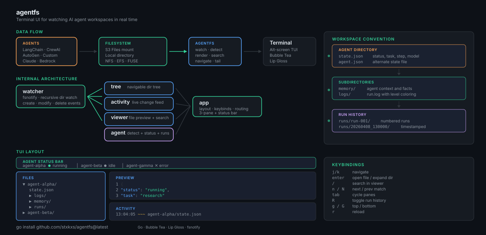

# agentfs

Watch AI agent workspaces on disk, in a terminal. Single binary, one argument.

Point it at a directory where agents persist state, logs, memory and artifacts. agentfs shows a live
tree, a file preview with syntax highlighting and search, an activity feed, per-agent status, and run
history — updating as the files change.

It also publishes the contract those agents write against, so what a workspace declares can be
validated rather than guessed at:

```sh
agentfs schema          # the JSON Schema for a state document
agentfs validate ./ws   # check a workspace against it; exit 1 on findings
agentfs scan ./ws       # what the agents declare, once, as text or JSON
```

Built with Go, [Bubble Tea](https://github.com/charmbracelet/bubbletea) and
[Lip Gloss](https://github.com/charmbracelet/lipgloss).

<p align="center">
  
</p>

---

## Install

```sh
go install github.com/stxkxs/agentfs@latest
```

Or from source, which requires Go 1.26.7 or later:

```sh
git clone https://github.com/stxkxs/agentfs.git
cd agentfs
task build     # or: go build -o agentfs .
./agentfs ./workspace
```

---

## Use

```sh
agentfs <directory>            # watch, the default
agentfs watch <directory>
agentfs scan <directory>       # one-shot, text or --format json
agentfs validate <directory>   # conformance gate, exit 1 on findings
agentfs doctor <directory>     # how the workspace is observed, and what it costs
agentfs schema                 # the published contract
agentfs version
```

`agentfs --help` lists every flag. Each has an `AGENTFS_`-prefixed environment variable.

---

## Filesystems

agentfs reads a workspace on any filesystem the operating system can mount, including NFS, EFS and
S3-backed FUSE mounts. How it observes change depends on which:

| Filesystem                        | Detection            | What is observed                                            |
| --------------------------------- | -------------------- | ----------------------------------------------------------- |
| Local (apfs, ext, xfs, btrfs, zfs, tmpfs, overlay) | kernel notification  | Every change, as it happens.                                 |
| NFS, EFS, SMB, Ceph               | notification + sweep | A local write immediately; a write by another client within one sweep interval. |
| FUSE, including S3 mounts         | notification + sweep | A write through the mount immediately; a change made behind it within one sweep interval. |
| Unrecognized                      | notification + sweep | Treated as remote, because assuming events arrive is the failure that shows an empty feed while looking healthy. |

Kernel change notification reports activity that passes through *this* kernel's VFS. A write made by
another client of a network export passes through a different one and raises no event here, so on
anything not known to be local agentfs also re-reads the directories it is displaying on an interval.
That sweep is bounded: its cost is a function of what is on screen, not of workspace size, and its
limit is that a change inside a collapsed directory is reported when the directory is opened rather
than immediately.

`agentfs doctor <directory>` reports which mode a workspace resolved to, what the filesystem was
probed as, and how many filesystem operations per hour the sweep costs. `--watch=notify|sweep|hybrid`
overrides the choice.

See [docs/how-to/watch-a-network-mount.md](docs/how-to/watch-a-network-mount.md).

---

## The workspace contract

Each immediate subdirectory of the workspace is an agent. An agent declares what it is doing in
`state.json`:

```json
{
  "schema": "agentfs/v1",
  "status": "running",
  "task": "retrieval",
  "step": 3,
  "steps_total": 8,
  "model": "claude-opus-5",
  "heartbeat_seconds": 30,
  "updated_at": "2026-04-08T13:00:00Z"
}
```

`status` is one of `running`, `idle`, `blocked`, `error`, `done`, matched exactly. A value outside the
vocabulary is a diagnostic naming the accepted set, not a guess. `problem` describes a fault and is
independent of `status`, so "finished, having recovered from a fault" and "progressing after a
transient failure" are both expressible.

A workspace directory that carries `logs/`, `memory/`, `artifacts/`, `tools/` or `runs/` is recognized
as an agent even when it declares no state document.

```
workspace/
├── agent-researcher/
│   ├── state.json
│   ├── memory/
│   ├── logs/run.log
│   └── runs/
│       ├── run-001/state.json     # run_id declares the run's identity
│       └── run-002/
└── agent-writer/
    ├── state.json
    └── artifacts/
```

The full contract is at [docs/reference/state-schema.md](docs/reference/state-schema.md), published as
JSON Schema by `agentfs schema`, and exercised by the conformance corpus in
`internal/conformance/testdata/cases`. Reference writers to vendor are in [contrib/](contrib/).

Write the document atomically — to a temporary file in the same directory, then rename over the target.
A reader observes a non-atomic rewrite torn; agentfs holds the last complete reading for a cycle rather
than flickering, and reports the torn read as a diagnostic naming the fix.

---

## Keys

| Key                 | Action                       |
| ------------------- | ---------------------------- |
| `j` / `k`           | Move down / up               |
| `h` / `l`           | Collapse / expand            |
| `enter`             | Open the selection           |
| `/`                 | Search the preview           |
| `n` / `N`           | Next / previous match        |
| `g` / `G`           | Top / bottom                 |
| `ctrl+u` / `ctrl+d` | Half-page scroll             |
| `tab` / `shift+tab` | Cycle panes                  |
| `f`                 | Follow the newest activity   |
| `R`                 | Run history                  |
| `r`                 | Reload                       |
| `b`                 | Response-time budgets        |
| `?`                 | Every binding                |
| `esc`               | Leave the mode or the search |
| `q`                 | Quit                         |

`docs/reference/keys.md` is generated from the same table that resolves a key press.

---

## Layout

```
╭──────────────────────────────────────────────────────────────────────────────╮
│  agent-researcher ● running (retrieval step 3/8)  │  agent-writer ✓ done      │
╰──────────────────────────────────────────────────────────────────────────────╯
╭─ Files ─────── 6 rows ─╮╭─ agent-researcher/state.json ───────── 9 lines ────╮
│❯ ▾ agent-researcher/   ││     1  {                                           │
│      state.json        ││     2    "schema": "agentfs/v1",                   │
│    ▸ logs/ (1)         ││     3    "status": "running",                      │
│    ▸ runs/ (2)         ││     4    "task": "retrieval",                      │
│  ▸ agent-writer/       │╰────────────────────────────────────────────────────╯
│                        │╭─ Activity ────────── following · 12 entries ───────╮
│                        ││  13:04:05 ~ agent-researcher/state.json            │
│                        ││  13:04:01 + agent-writer/artifacts/draft.md        │
╰────────────────────────╯╰────────────────────────────────────────────────────╯
  apfs · notify ✓ complete view
```

The bottom line answers *am I seeing everything*. It names the filesystem, the detection mode, and
every condition limiting the view — a dropped batch, an exhausted watch budget, a capped directory, an
unreadable document — most serious first, with a count of any it could not fit.

`b` opens the response-time budgets: the deadline agentfs holds each of its own paths to, how many
observations the session took, how many missed, and the percentiles behind them. The record is kept
while frames are drawn, so it is read here rather than from a command that prints and exits.

Every distinction drawn in colour is also drawn with a glyph, so a monochrome terminal keeps it.
`--color=never` and `--ascii` are supported.

---

## Documentation

| | |
| --- | --- |
| [Getting started](docs/tutorial/getting-started.md) | From nothing to a watched workspace |
| [How-to guides](docs/how-to/) | Emit state, watch a network mount, gate CI, read the output |
| [Reference](docs/reference/) | CLI, flags, keys, exit codes, diagnostics, the contract, platforms |
| [Explanation](docs/explanation/) | Architecture, change detection, limits |
| [Runbook](docs/runbook.md) | Symptoms, causes, what to do |
| [Threat model](docs/threat-model.md) | Boundaries, controls, non-goals |
| [Contributing](CONTRIBUTING.md) | Conventions and the gate |

---

## License

[MIT](LICENSE)
