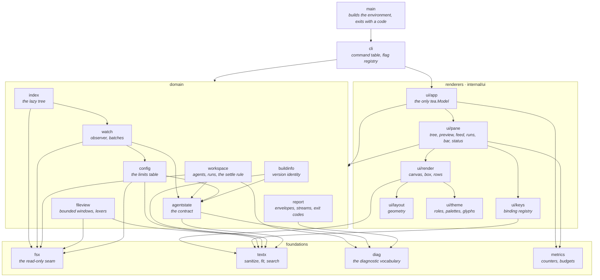

# Architecture

agentfs reads a directory it does not own, written by processes it does not control, and draws it in
a terminal. The package graph follows from that sentence. The packages that decide what a workspace
means never learn that a terminal exists. The packages that draw never learn that a filesystem
exists. Everything that touches the workspace goes through one read-only seam.

## The package graph



Arrows drawn to a group stand for imports of several of its members. The exact edges are what the
toolchain reports:

```sh
go list -f '{{.ImportPath}} -> {{join .Imports " "}}' ./... | grep stxkxs/agentfs
```

`ui/layout` and `ui/theme` sit at the bottom of the renderers with no internal imports at all;
`fsx`, `textx`, `diag` and `metrics` sit at the bottom of everything.

## The dependency rule

No package below `cli` imports a renderer. A domain package cannot reach `ui/app`, `ui/pane`,
`ui/render`, `ui/keys`, `ui/layout` or `ui/theme`, so nothing about how a value is drawn can leak
into the decision about what it means. The rule is verifiable rather than aspirational — this
prints nothing:

```sh
go list -deps ./internal/agentstate ./internal/workspace ./internal/index ./internal/watch \
    ./internal/fileview ./internal/config ./internal/report | grep 'agentfs/internal/ui'
```

Two consequences an author has to live with. A domain package that wants to say something to the
operator returns a value — a `diag.Diagnostic`, a `watch.Stats`, an `index.Stats` — and the pane
decides how it looks. And a rendering concern that needs workspace knowledge takes it as an
argument: `pane.Conditions` is handed `watch.Stats` and `index.Stats` and ranks them, rather than
reaching for either.

The rule points one way only. `ui/pane` imports `workspace`, `index`, `watch`, `fileview` and
`agentstate` freely, because a pane's whole job is to render those types.

Two packages hold themselves to something stricter, and each is guarded by a test in its own
directory. `ui/layout` imports only the standard library, so geometry is arithmetic that can be
exercised without constructing anything (`TestThePackageImportsOnlyTheStandardLibrary`).
`ui/keys` reaches for no terminal framework, so a binding table resolves a press spelled as a
string without a terminal to press it in (`TestPackageReachesForNoTerminalFramework`).

## The filesystem seam

Every byte agentfs reads from a workspace passes through `fsx.FS`:

```go
type FS interface {
    fs.FS
    fs.StatFS
    fs.ReadDirFS
    fs.ReadFileFS
    fs.ReadLinkFS
}
```

It is an interface, and it is satisfied by both `os.Root.FS()` and `testing/fstest.MapFS`. That is
the whole design, and it buys three properties.

**Confinement is structural.** `fsx.Open` opens the workspace with `os.OpenRoot`. Resolution is
`openat`-based and refuses any path that leaves the root, including one reached through a symlink,
which `os.DirFS` resolves happily. `TestSymlinkEscapeIsRefused` in `internal/fsx` builds a workspace
holding both a relative and an absolute escaping link, checks that ordinary reads follow them, and
then checks that the confined root refuses both.

**Read-only is structural.** The interface declares no method that writes. There is no code path
above the seam that can modify an observed workspace, because there is no method to call.
`TestFSSeamHasNoWriteMethod` asserts that by reflection over the interface type, so adding a write
method to the seam fails the suite rather than quietly widening what agentfs can do to a workspace.

**Tests are the same code path as production.** A `fstest.MapFS` is a workspace with no filesystem
under it: a test builds one in a map, hands it to `fsx.New`, and every layer above reads it through
the type it reads a real root through. Two decorators in `internal/fsx` extend that — `Counting`
tallies operations by kind, which is how a bounded-work claim is asserted rather than asserted about
(`TestNewReadCountIsIndependentOfWorkspaceSize`, `TestSweepCostIsIndependentOfWorkspaceSize`), and
`Faulty` injects an error at the *n*th operation on a matching path, which is how the unreadable
directory, the vanished document and the lost root are exercised without unmounting anything.

`fsx.Root` adds the two operations an interface over `io/fs` cannot express: `Root.Health` reports
whether the root itself still reads, wrapping `fsx.ErrRootLost` so a caller separates a vanished
mount from one unreadable file, and `Root.Reopen` re-resolves the path to recover from a remount.
`Root.ReadRange` reads a byte window with the file's size, so following a growing log costs the
appended bytes.

## Why the index names directories rather than reading them

A read of a network export blocks for as long as the mount's timeout. An index that read a directory
inside the call that asked for it would freeze the interface under exactly the conditions agentfs
exists to observe — a slow or wedged mount is the interesting case, not the pathological one.

So `index.Index` never performs the read the caller did not ask it to perform:

- `Index.Pending` returns the workspace-relative paths the index needs read, in path order.
- `Index.Read` performs one such read and returns an `index.Loaded`.
- `Index.Adopt` folds a `Loaded` into the tree, preserving the identity and open state of members
  that survived, so a reader's cursor and expansions outlive a reload.

The caller decides which goroutine pays. A one-shot command calls `Index.Drain`, which reads and
adopts on the calling goroutine until nothing is pending — blocking is the point there.
`app.Model.readPending` issues one `tea.Cmd` per pending path instead, each returning a `loadedMsg`
that `Model.Update` adopts. The update goroutine performs no filesystem work at all.

Two further properties of the index follow from the same concern for bounded work. Children are read
when a directory is opened rather than when the workspace is scanned, so starting against a
workspace of any size reads one directory (`TestNewReadsOnlyTheRoot`). And a change batch is applied
by reloading only the loaded directories the batch names, so one agent writing one file costs one
directory read rather than a walk (`TestBurstOnOneDirectoryCostsOneRead`).

Symlinks are recorded and never followed. A link is a leaf whatever it points at, which makes a link
cycle unrepresentable rather than merely bounded (`TestSymlinkIsNeverFollowed`).

## Why the model is the only tea.Model

`app.Model` is the one type in the repository that implements `Init`, `Update` and `View`. Every
pane below it — `pane.Tree`, `pane.Preview`, `pane.Feed`, `pane.Runs`, `pane.AgentBar`, `pane.Help`,
`pane.Status` — is a plain value carrying a cursor and a scroll offset, with a `View` that takes a
rectangle and returns lines, and an `Update` that takes a `keys.Action`.

The payoff is in what a test has to build. Asserting that the tree renders inside its rectangle at
every terminal size means calling a method in a loop (`TestTreeFitsEveryRect`), not driving a
terminal and diffing an escape stream. Asserting that a key press moves the selection and expands a
directory means calling `Update` with an action (`TestTreeNavigationMovesAndExpands`). The frame as a
whole is still exercised end to end through the model — `TestFrameFitsEveryTerminalSize`,
`TestFrameSurvivesHostileContent`, `TestFrameIsStableAcrossRenders` — but those are a handful of
tests over one type rather than the only way to reach any behaviour.

Two rules keep that shape from eroding.

**Geometry is computed once per resize.** `Model.Update` handles `tea.WindowSizeMsg` by storing
`layout.Compute`'s result in the model. `View` reads the stored frame. A render costs no arithmetic
about where the panes go.

**Exactly one batch read is outstanding.** `Model.Init` issues `waitForBatch`, and every `batchMsg`
issues the next one. Two would race for `Observer.Batches()` and deliver batches to the model out of
order.

## Where the contracts live

Four packages exist because a contract needs one place to be stated, and none of them import
anything that renders.

`agentstate` is the workspace contract: the document an agent writes, the status vocabulary, the
decoder, and `SchemaJSON` — the same JSON Schema `agentfs schema` prints. Every reader in agentfs
goes through it rather than matching filenames of its own, which is why the convention can be
versioned and validated instead of only described.

`diag` is the diagnostic vocabulary. A code is permanent and retired rather than reused, so a
consumer that suppresses one never has it come to mean something else. The registry is the source
the diagnostic reference is generated from.

`config` is the table of every ceiling: flag name, environment variable, unit, default, and the
prose that explains the number. Flag registration and the generated reference are both rendered from
`config.Limits()`, and a test asserts by reflection that the table names every field of
`config.Config` — a ceiling that is not in the table cannot be set and cannot be documented. See
[limits.md](limits.md).

`report` is every machine-readable byte agentfs emits and the exit codes it emits them alongside:
`report.Envelope` for a one-shot result under `--format json`, `report.Record` for the change stream
`agentfs watch --format ndjson` writes, and `report.Codes()` for the exit-code table the help text
and the reference both print. Each vocabulary is a table the commands are held to from both
directions — `TestEveryKindIsEmitted` and `TestEveryRecordKindIsEmitted` fail on a kind no command
produces as well as on one produced from outside the table.

## Related

- [change-detection.md](change-detection.md) — what the observer sees, what it misses, and what a
  batch means.
- [limits.md](limits.md) — every ceiling and what reaching it looks like.
- [../runbook.md](../runbook.md) — the same failure modes as symptoms.
- [../threat-model.md](../threat-model.md) — the boundaries this shape defends.
