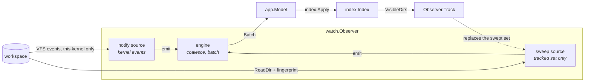

# Change detection

agentfs claims to work on network filesystems — NFS, EFS, SMB, Ceph, and S3-backed FUSE mounts. This
document is the mechanism behind that claim, its cost, and its limits.

The claim is not free, because the obvious implementation makes it false. Kernel change notification
reports activity that passes through *this* kernel's VFS. A write made by another client of a network
export passes through a different kernel and raises no event here. A watcher built on notification
alone, pointed at an EFS mount two other machines are writing, reports a workspace that has not
changed since it was opened — and looks perfectly healthy while doing it. An empty feed is
indistinguishable from an idle workspace.

So agentfs runs a bounded stat sweep alongside kernel notification on any filesystem not known to be
local, and reports on screen which mechanism it chose.

## The two mechanisms

### Kernel notification

`internal/watch/notify.go` wraps [fsnotify](https://github.com/fsnotify/fsnotify). At start,
`notifySource.addTree` walks the workspace through the confined root and registers a watch per
directory, stopping at the watch budget and at an internal depth bound (`maxWalkDepth`). A directory
created later is watched when its creation event arrives.

**What it observes.** Every create, write, remove, rename and chmod that passes through this kernel,
as it happens. `translateOp` maps them onto `watch.OpCreate`, `OpModify`, `OpRemove` and
`OpRename`; a chmod is reported as a modification, because a permission change alters what agentfs
can read next.

**What it costs.** Nothing while the workspace is idle. The cost is the watch registrations, and
those are finite: Linux enforces a per-user inotify limit, and a large workspace exhausts it.

**Where a path is dropped.** An event whose path does not resolve inside the workspace is discarded
at the source. `notifySource.translate` puts every path through `fsx.Clean`, which refuses an
absolute path, a path containing `..` that climbs out, and anything `fs.ValidPath` rejects. Reporting
such a path would name a file no layer above can read through the confined root.

### The stat sweep

`internal/watch/sweep.go` re-reads the tracked directories on an interval and compares each member
against the previous reading. A member whose fingerprint differs is a modification, one that appeared
is a creation, one that vanished is a removal.

The fingerprint is size, modification time, directory-ness — and, for a state document under
`digestLimit`, an FNV-1a digest of its content. The digest is not an optimisation, it is a
correctness fix: filesystems report modification times at a granularity as coarse as a second, so a
document rewritten within one second at the same length is invisible to a size-and-time comparison.
That is exactly the shape of an agent updating its status. `TestDigestDetectsASameSizeSameTimeRewrite`
holds that closed. Hashing every file instead would make sweep cost proportional to workspace bytes,
so only documents `agentstate.IsStateFile` names are hashed.

**What it observes.** Any change to a tracked directory's members, whoever made it and through
whichever kernel, within one sweep interval. `TestSweepDetectsAChangeNoKernelEventReported` is the
claim of this document in one test.

**What it costs.** One `ReadDir` per tracked directory per cycle, plus one `ReadFile` per state
document small enough to hash. `--sweep-budget` caps the operations one cycle spends; a tracked set
larger than the budget is covered across successive cycles, round-robin, by `engine.sweepSlice`, so a
large set slows detection rather than stalling the loop. `agentfs doctor` prints the resulting
ceiling in filesystem operations per hour, and states that N instances pointed at one export cost N
times that.

### Which one runs

`watch.New` probes the filesystem with `fsx.Classify` and resolves the mode through
`config.Config.FilesystemMode`, so the rule has one statement:

| Probed kind    | Examples                                  | Resolved mode | Why |
| -------------- | ----------------------------------------- | ------------- | --- |
| `local`        | apfs, ext, xfs, btrfs, zfs, tmpfs, overlay, f2fs | `notify` | Every write passes through this kernel. |
| `network`      | NFS, EFS, SMB, Ceph                       | `hybrid`      | Another client can write without this kernel seeing it. |
| `fuse`         | FUSE mounts, including S3-backed ones     | `hybrid`      | A write through the mount raises an event; an object replaced behind it does not. |
| `unknown`      | anything the probe does not recognize     | `hybrid`      | Assuming events arrive is the failure that shows nothing while looking healthy. |

An unprobeable or unrecognized filesystem takes the conservative mode. So does any platform whose
`statfs` shape agentfs does not read — `internal/fsx/class_other.go` reports `unprobed`, which
resolves to `hybrid`.

`--watch=notify|sweep|hybrid` overrides the probe. `agentfs doctor <directory>` reports what the
probe found and what the mode resolved to, so an operator reads the answer rather than inferring it
from an empty feed.

## What neither mechanism observes

- **A change inside a collapsed directory, until it is opened.** The sweep covers the tracked set,
  which is the viewport. See below.
- **A change below the depth ceiling or beyond the per-directory entry ceiling.** Those subtrees are
  not in the index, so they are not tracked. See [limits.md](limits.md).
- **A change to a directory the watcher was refused and the sweep does not cover.** Under `notify`
  there is no sweep, so a directory beyond the watch budget is unobserved until a reload.
- **The content of a change.** A batch says a path changed, not how. The consumer re-reads.
- **Ordering against the writer.** `Change.At` is when the change was *observed*, which for a swept
  change is the sweep rather than the write. An agent's own `updated_at` is the agent's claim about
  when it wrote; the two answer different questions and neither substitutes for the other.

## The tracked set is bound to the viewport

Sweep cost has to be a function of what is on screen, not of workspace size — otherwise a
400,000-file monorepo cannot be watched at all.

`watch.Observer.Track` replaces the swept set. `app.Model.readPending` calls it with
`index.VisibleDirs()`, which returns the root plus every directory that is both *loaded* and
*expanded*. A collapsed directory is excluded: its members are not rendered, and opening it reads it
again, so sweeping it would spend operations on a difference nobody is looking at.

A stream has no viewport, so `agentfs watch --format ndjson` sweeps a set with the same property:
`cli.sweptDirs` returns the root, every agent directory below it, and the conventional subdirectories
those declare. It costs one directory read per agent rather than a walk, which is the same bound the
viewport gives the terminal form. A change deeper than a conventional subdirectory is observed by
kernel notification and, on a filesystem where notification is incomplete, when the directory holding
it is next read.

`TestSweepCostIsIndependentOfWorkspaceSize` and `TestVisibleDirsFollowsTheViewport` hold the two
halves of that loop.

**The limit this imposes, stated plainly:** on a network mount, a change made by another client
inside a directory the operator has collapsed is reported when that directory is opened, not when it
happens. Opening a directory reads it, so the state on screen is correct from the moment it appears —
what is delayed is the notification, not the content.

## Coalescing, and what a batch means

A consumer that rebuilt its view once per raw event would rebuild it fifty times for one agent's
write burst. So the engine accumulates.

Raw changes arrive on a channel read by a single goroutine, `engine.run`, which owns all batch state
— coalescing needs no lock, and the ordering of a change against a window close is not a race. The
first change opens a **window**. Every change inside the window goes into a `builder`, which folds
repeats: two changes to one path become one entry, with `mergeOp` deciding which operation the
consumer must act on (a create followed by a modification is still a create; a removal followed by a
create is a create). When the window closes, the builder becomes the batch ready for delivery.

The window is `watch.Options.Window`, supplied by `watch.DefaultOptions` — the command line does not
expose it.

If the consumer is busy when a batch is ready, the next window's builder is *merged* into the waiting
one rather than discarded (`builder.merge`, `TestEngineAccumulatesWhileTheConsumerIsBusy`). A slow
consumer gets fewer, larger batches; it does not get fewer changes.

A `watch.Batch` carries:

| Field | Meaning |
| --- | --- |
| `Changes` | Ordered by path, then by operation, so a batch is comparable and a golden test over one is stable. |
| `At` | When the batch was closed. |
| `Stats` | The source's state at that moment — mode, filesystem, watches, tracked size, sweep cycle, counters. |
| `Seeded` | The source's first delivery. It carries no changes. |
| `Truncated` | Changes were discarded because the batch reached `--max-batch`. Always accompanies `Resync`. |
| `Resync` | The batch is **not** a complete account. Rebuild from the filesystem instead of applying `Changes`. |
| `RootLost` | The workspace root became unreadable. |
| `RootRecovered` | The root became readable again. Always accompanies `Resync`. |

### The seeded batch

The first delivery establishes what exists without reporting it as change. The sweep records every
tracked directory's members; the batch that follows carries no changes at all. Reporting the whole
workspace as created would announce a storm that did not happen, and a consumer would rebuild
everything to learn nothing. `index.Apply` returns immediately on `Seeded`
(`TestSeededBatchChangesNothing`).

### What a resync means

`Resync` is the engine admitting that `Changes` cannot be trusted as a complete account of what
happened. The consumer must discard its incremental reasoning and rebuild from the filesystem.
`index.Apply` does exactly that: `Resync` or `RootRecovered` calls `Index.Rebuild`, which discards
everything below the root, reads it again, and preserves which directories were open so the
operator's place is not lost (`TestResyncRebuildsAndPreservesOpenDirectories`).

Two conditions raise it: the batch ceiling, and root recovery. Both are below.

## The record stream and at-least-once delivery

In `hybrid` mode two sources observe the same filesystem, and a local write to a watched directory is
seen by both. `hybridSource.dedupe` suppresses the repeat within `--dedup-ttl`, keyed on
`Change.DedupKey` — the path and the operation, independent of when either was observed. Anything
that survives is folded by the coalescer if it lands in the same window.

Consequence to design around: within `--dedup-ttl` of an emitted change, a further change to that
same path with the same operation is suppressed. On a busy state document under `hybrid`, the
operator sees the first write of a burst and the state as of the next admitted observation.

`agentfs watch --format ndjson` is the producer of the record stream, and a `watch` whose output is
not a terminal writes it whether or not it was asked for by name. The record shapes are in
[read-agentfs-output.md](../how-to/read-agentfs-output.md).

The NDJSON record stream in `internal/report` is **at-least-once**, and a consumer has to be built
for that. `report.Record` carries two identifiers because they answer different questions:

- `Seq` orders the records one producer emitted, densely from 1. A gap is a loss. It cannot tell you
  anything about a record you have already accepted, and a producer that restarts begins again at 1.
- `DedupKey` names the underlying event. A consumer discards a repeat by key — across a reconnect,
  across a producer restart, and across the two sources of a hybrid observer.

So: **dedupe on key, detect loss from a gap in `Seq`.** A consumer that treats `Seq` as an identity,
or that assumes exactly-once, will double-count across a restart. `report.Stream.Write` takes its
sequence number before writing the line and never reuses it, so a failed write leaves a gap rather
than a duplicate — the failure a consumer can detect, rather than the one it cannot.

## Failure modes

### The watch-descriptor budget is exhausted

**What happens.** `notifySource.addTree` stops registering at `--max-watches`, and the kernel can
refuse a registration before that (Linux `max_user_watches`). Each refusal increments
`Stats.WatchesRefused`. Under `hybrid`, a refused directory is still covered by the sweep when it is
in the tracked set. Under `notify` nothing covers it: changes inside it are not observed until a
reload or a resync.

**What the operator sees.** The status line reports `N directories swept, not watched`, and a stream
consumer reads `watches_refused` on the next status record. `agentfs doctor` prints the watch budget.

**What to do.** [runbook.md § Part of the tree is swept rather than watched](../runbook.md#part-of-the-tree-is-swept-rather-than-watched).

### The batch ceiling is reached

**What happens.** `builder.add` refuses a new path once the batch holds `--max-batch` of them. Beyond
the ceiling the batch stops being a complete account, so rather than hand the consumer a partial
one it counts the drop, sets `Truncated`, and sets `Resync`. `Stats.Dropped` accumulates.
`TestBuilderOverflowSetsTruncatedAndResync` holds it.

**What the operator sees.** The status line reports `N changes dropped, resynchronized`, ranked as
severe. The tree rebuilds and the open directories are preserved. A stream consumer reads a status
record whose event is `resync`, with `dropped` counting how much was missed.

**What it means.** No change was lost from the *view* — the resync re-reads the filesystem, which is
authoritative. What was lost is the per-path detail: the activity feed and the recency highlighting
do not show the individual changes that were dropped.

### The root vanishes

**What happens.** The engine probes `Root.Health` on every tick, in every mode. An error wrapping
`fsx.ErrRootLost` — an unmounted export, a stale NFS handle, a deleted directory — sets
`Stats.RootLost` and delivers a batch with `RootLost` set. The engine then stops sweeping and starts
trying to recover, backing off from `--root-retry-min` to `--root-retry-max`, doubling each failure.

Recovery requires two successes: `Root.Reopen` has to re-resolve the path, *and* `Root.Health` has to
read through the reopened root. A reopen that succeeds against a still-broken mount would declare
recovery and immediately lose it again. When both succeed the source is seeded afresh and a batch
carrying `RootRecovered` and `Resync` is delivered, because changes during the outage were not
observed. `TestEngineReportsRootLossAndRecovery` and `TestEngineRecoversWhenTheRootReturns` hold both
halves.

**What the operator sees.** The status line reports `workspace root unreadable — retrying`, ranked
most severe. A one-shot command reports `AFS5010` against the workspace, in the envelope under
`--format json`. A stream consumer reads a status record whose event is `root_lost`, and on recovery
one whose event is `root_recovered` followed by a `resync`. On recovery the tree rebuilds with the
open directories preserved.

### A torn write

**What happens.** An agent that rewrites `state.json` in place, rather than writing a temporary file
and renaming over the target, can be read mid-write. The bytes are a fragment of JSON.

Change detection reports this correctly — the file did change. The interpretation is the scanner's
job. `workspace.Scanner` remembers each document's size and modification time between scans, and
applies the **settle rule**: a document that fails well-formedness *and* changed since the last
reading is `PresenceSettling`, not `PresenceInvalid`. The last complete reading stands, and an
`AFS4010` info diagnostic names the fix. A document that stops changing and still does not decode is
reported as invalid. `TestTornWriteDoesNotFlapTheStatus` and `TestASettledSyntaxErrorIsReported` hold
the two sides.

A semantic error is never settled — a status outside the vocabulary is wrong however stable the file
is (`TestASemanticErrorIsNeverSettled`).

**What the operator sees.** The agent bar holds the agent's last known status rather than flickering
between it and a parse error on every write. `agentfs validate` reads once, so nothing settles there:
a torn document is reported as `AFS1001`, with the hint naming atomic replacement.

**What to do.** Write the document atomically: to a temporary file in the same directory, then rename
over the target. The reference writers in [contrib/](../../contrib/) do this.

## Related

- [architecture.md](architecture.md) — why the index names directories rather than reading them.
- [limits.md](limits.md) — every ceiling named here, and the rest.
- [../runbook.md](../runbook.md) — these failure modes as symptoms, with what to do.
